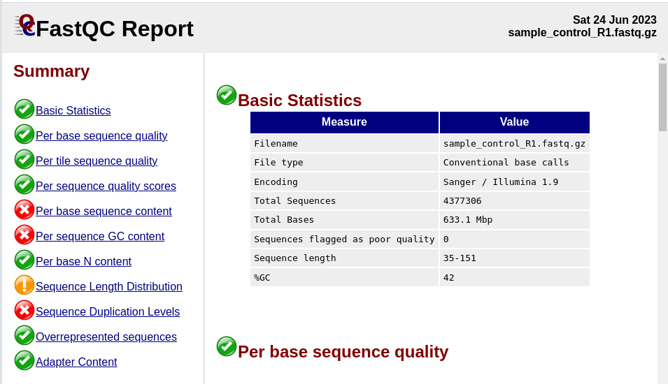
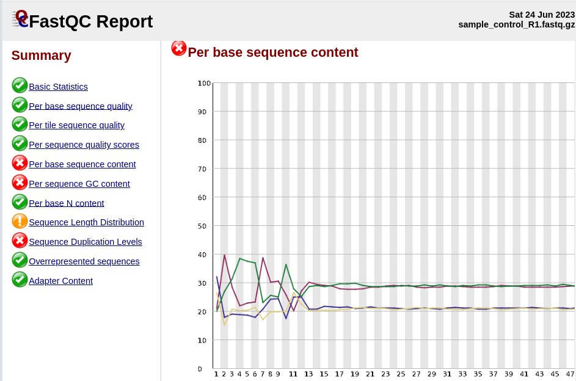
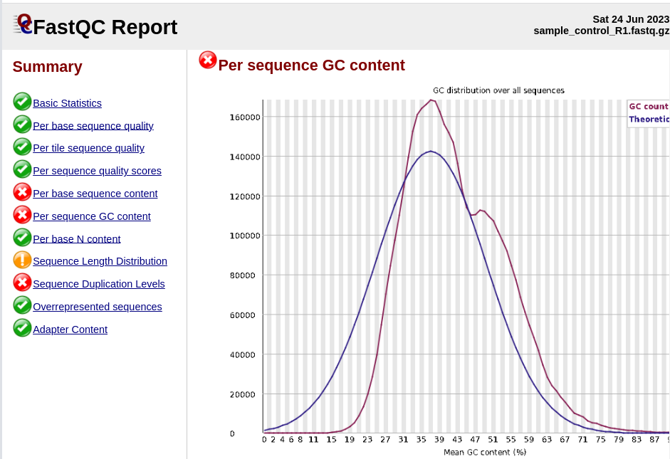
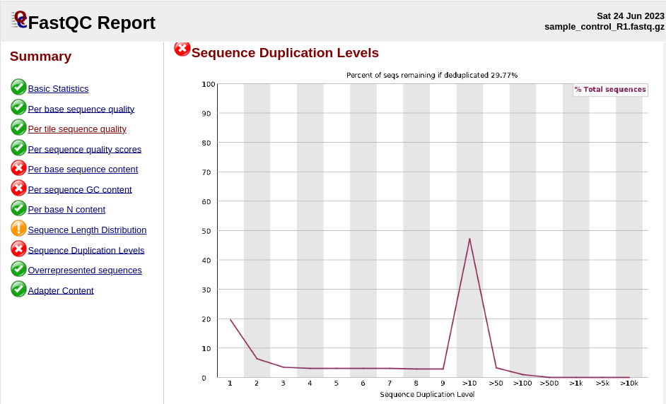
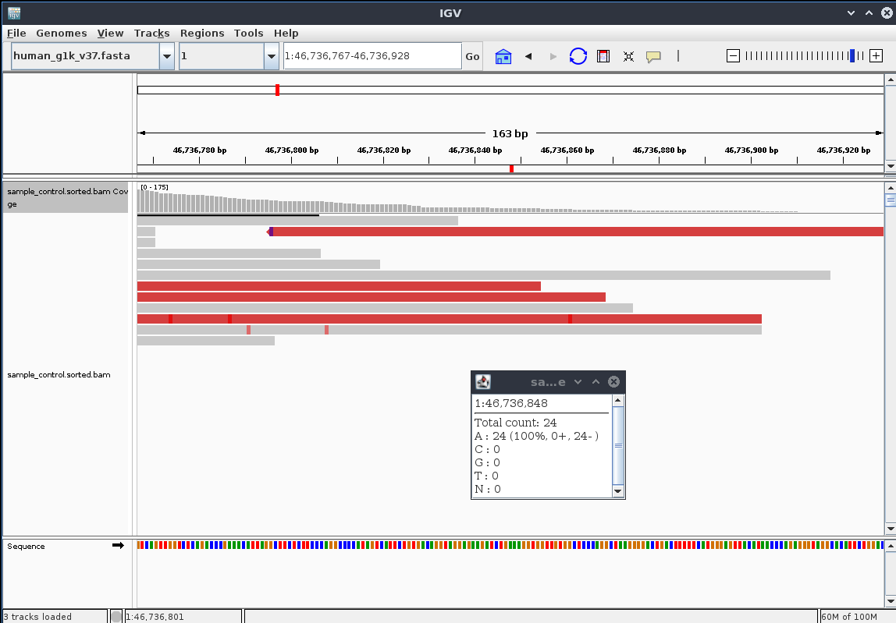
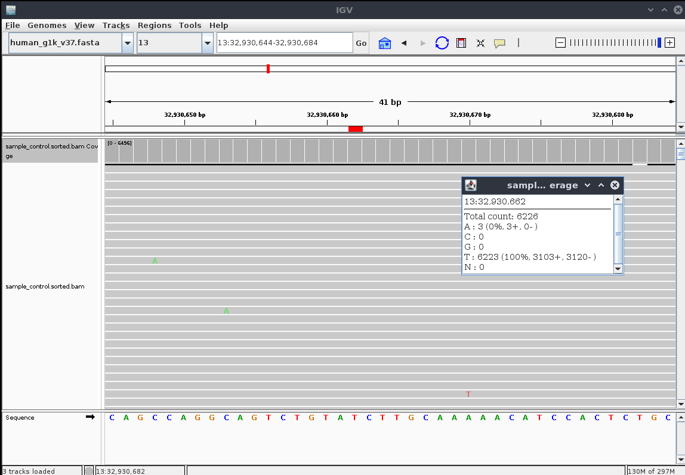
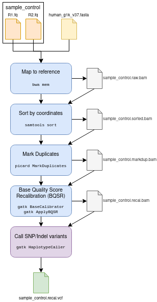

```{r, echo=FALSE, message=FALSE, warning=FALSE, results='hide'}
require(tidyverse)
```


# Quality Control

FastQC reports look healthy. Sequencing adapters were already removed.


Although there are some red flags raised,there is a benign explanation for each of them:

## Per base sequence content

The sequence bias in the first 12 positions of the reads is consistent with the bias introduced by Tn5 transposase tagmentation (used e.g. in Nextera library prep), as [discussed in the literature](https://bmcbiotechnol.biomedcentral.com/articles/10.1186/s12896-016-0326-1#Sec9).

**NOTE:** If library prep did not involve Tn5 transposase tagmentation, this could point to a problem with this library.



## Per Sequence GC content

The per-sequence GC content distribution shows two peaks, one at ~37% and another one at ~48%. Since the sequencing reads originate from a targeted sequencing experiment, the two peaks most likely correspond to exonic (high GC content) and intronic (low GC content) regions (for reference, see e.g. [Amit et al. 2012](https://pubmed.ncbi.nlm.nih.gov/22832277/)).



## Sequence duplication levels

Duplicated sequences are to be expected, especially in a targeted sequencing experiment, and, more generally, if library prep involved a PCR amplification step. PCR duplicates will be removed in deduplication step during the preprocessing of the analysis pipeline.

**NOTE:** If library prep did not involve PCR amplification, this could point to a problem with this library.



# 1. Variant calling analysis

## Implementation

I chose to implement the pipeline as a Snakemake workflow for reproducibility, using Conda environments to manage tool dependencies.

The code can be found on [GitHub](https://github.com/hdetering/SG_varcall_assignment).


## Results

The variants identified by the variant calling pipeline (for details, see section 3.) are contained in the output file `results/sample_control.recal.vcf`.

# 2. Analytical performance

The comparison with the true variants (`data/ground_truth.vcf`) yields the following confusion matrix:

```{r}
df_eval <- read.csv('../results/sample_control.eval.csv', header = FALSE, col.names = c('metric', 'value'))
df_eval
```

Accordingly, we obtain the following performance measures:

```{r}
tp <- df_eval %>% dplyr::filter(metric == 'TP') %>% select(value) %>% pull()
fp <- df_eval %>% dplyr::filter(metric == 'FP') %>% select(value) %>% pull()
tn <- df_eval %>% dplyr::filter(metric == 'TN') %>% select(value) %>% pull()
fn <- df_eval %>% dplyr::filter(metric == 'FN') %>% select(value) %>% pull()

sprintf('Sensitivity / Recall: %.2f', 100 * tp / (tp + fn))
sprintf('Precision: %.2f', 100 * tp / (tp + fp))
sprintf('Specificity: %.2f', 100 * tn / (tn + fp))
```

Next, let us inspect the FN and FP calls more in detail.

## False Negatives (FN)

The following calls were contained in the ground truth variants, but not detected by the variant caller:

```text
1	46736848	.	A	T	.	.	.	.	.
13	32930662	.	T	A	.	.	.	.	.
```

### 1:46736848

For the first FN position (1:46736848), there are simply no ALT bases aligned to the reference. Additionally, the locus is at near the limit of the targeted locus, so there is probably not enough read coverage to capture this particular variant. 

   

### 13:46736848

For the second FN position (13:32930662), read coverage is not an issue. However, the number of reads (3/6226) representing the ALT allele "A" is very low. Due to this extreme allelic imbalance, the variant caller did not detect the variant:

   


## False Positives (FP)

There were a total of 17 FP variants reported by HaplotypeCaller that were not in the ground truth variants:

```text
2	58390218	.	TA	T	934.60	.	AC=1;AF=0.500;AN=2;BaseQRankSum=0.477;DP=3099;ExcessHet=0.0000;FS=0.000;MLEAC=1;MLEAF=0.500;MQ=60.00;MQRankSum=0.000;QD=0.34;ReadPosRankSum=1.618;SOR=0.630	GT:AD:DP:GQ:PL	0/1:2384,382:2766:99:942,0,52413
3	10088266	.	G	T	10776.64	.	AC=1;AF=0.500;AN=2;BaseQRankSum=6.316;DP=3663;ExcessHet=0.0000;FS=17.748;MLEAC=1;MLEAF=0.500;MQ=58.95;MQRankSum=-25.711;QD=3.05;ReadPosRankSum=-2.135;SOR=1.939	GT:AD:DP:GQ:PL	0/1:2871,659:3530:99:10784,0,77659
3	10088299	.	C	T	37864.64	.	AC=1;AF=0.500;AN=2;BaseQRankSum=-6.921;DP=3967;ExcessHet=0.0000;FS=9.418;MLEAC=1;MLEAF=0.500;MQ=55.26;MQRankSum=-22.140;QD=9.64;ReadPosRankSum=1.739;SOR=1.414	GT:AD:DP:GQ:PL	0/1:2797,1132:3929:99:37872,0,110674
3	10088308	.	T	C	40728.64	.	AC=1;AF=0.500;AN=2;BaseQRankSum=-7.445;DP=4149;ExcessHet=0.0000;FS=9.152;MLEAC=1;MLEAF=0.500;MQ=54.32;MQRankSum=-22.828;QD=10.08;ReadPosRankSum=0.647;SOR=1.356	GT:AD:DP:GQ:PL	0/1:2791,1248:4039:99:40736,0,110422
3	10088343	.	A	G	30639.64	.	AC=1;AF=0.500;AN=2;BaseQRankSum=-0.130;DP=4407;ExcessHet=0.0000;FS=3.433;MLEAC=1;MLEAF=0.500;MQ=51.28;MQRankSum=-18.393;QD=7.08;ReadPosRankSum=8.572;SOR=0.976	GT:AD:DP:GQ:PL	0/1:2835,1490:4325:99:30647,0,74244
3	10088404	.	C	T	42289.64	.	AC=1;AF=0.500;AN=2;BaseQRankSum=-0.998;DP=3436;ExcessHet=0.0000;FS=2.579;MLEAC=1;MLEAF=0.500;MQ=45.98;MQRankSum=-22.335;QD=12.68;ReadPosRankSum=-0.921;SOR=0.884	GT:AD:DP:GQ:PL	0/1:2148,1187:3335:99:42297,0,84547
3	10088407	.	AG	A	41939.60	.	AC=1;AF=0.500;AN=2;BaseQRankSum=-5.160;DP=3318;ExcessHet=0.0000;FS=1.847;MLEAC=1;MLEAF=0.500;MQ=45.64;MQRankSum=-23.113;QD=12.65;ReadPosRankSum=-1.353;SOR=0.857	GT:AD:DP:GQ:PL	0/1:2144,1172:3316:99:41947,0,85360
3	10088409	.	TAAG	T	41162.60	.	AC=1;AF=0.500;AN=2;BaseQRankSum=8.263;DP=3274;ExcessHet=0.0000;FS=1.171;MLEAC=1;MLEAF=0.500;MQ=45.33;MQRankSum=-23.094;QD=12.67;ReadPosRankSum=-1.101;SOR=0.821	GT:AD:DP:GQ:PL	0/1:2107,1141:3248:99:41170,0,84492
3	10089723	.	G	A	25892.64	.	AC=1;AF=0.500;AN=2;BaseQRankSum=5.490;DP=3797;ExcessHet=0.0000;FS=7.643;MLEAC=1;MLEAF=0.500;MQ=59.73;MQRankSum=-13.295;QD=6.98;ReadPosRankSum=-0.171;SOR=1.181	GT:AD:DP:GQ:PL	0/1:2516,1193:3709:99:25900,0,62164
3	10089738	.	A	G	22897.64	.	AC=1;AF=0.500;AN=2;BaseQRankSum=11.272;DP=3558;ExcessHet=0.0000;FS=7.916;MLEAC=1;MLEAF=0.500;MQ=59.69;MQRankSum=-14.152;QD=6.58;ReadPosRankSum=-7.217;SOR=1.269	GT:AD:DP:GQ:PL	0/1:2418,1064:3482:99:22905,0,61710
11	108183167	.	A	G	80115.06	.	AC=2;AF=1.00;AN=2;DP=2775;ExcessHet=0.0000;FS=0.000;MLEAC=2;MLEAF=1.00;MQ=60.00;QD=29.83;SOR=0.798	GT:AD:DP:GQ:PL	1/1:0,2686:2686:99:80129,8038,0
13	32907535	.	CT	C	5877.60	.	AC=1;AF=0.500;AN=2;BaseQRankSum=0.341;DP=3522;ExcessHet=0.0000;FS=0.000;MLEAC=1;MLEAF=0.500;MQ=60.00;MQRankSum=0.000;QD=1.88;ReadPosRankSum=1.255;SOR=0.636	GT:AD:DP:GQ:PL	0/1:2524,605:3129:99:5885,0,59450
14	68944343	.	CT	C	5903.60	.	AC=1;AF=0.500;AN=2;BaseQRankSum=2.438;DP=1916;ExcessHet=0.0000;FS=0.000;MLEAC=1;MLEAF=0.500;MQ=60.00;MQRankSum=0.000;QD=3.84;ReadPosRankSum=1.450;SOR=0.729	GT:AD:DP:GQ:PL	0/1:1008,531:1539:99:5911,0,20681
14	69149648	.	G	T	1664.04	.	AC=1;AF=0.500;AN=2;BaseQRankSum=-0.138;DP=563;ExcessHet=0.0000;FS=129.730;MLEAC=1;MLEAF=0.500;MQ=59.97;MQRankSum=-1.970;QD=3.44;ReadPosRankSum=4.276;SOR=9.044	GT:AD:DP:GQ:PL	0/1:363,121:484:99:1888,0,13489
14	69149650	.	A	T	2031.64	.	AC=1;AF=0.500;AN=2;BaseQRankSum=-3.169;DP=547;ExcessHet=0.0000;FS=145.224;MLEAC=1;MLEAF=0.500;MQ=59.97;MQRankSum=-1.814;QD=4.16;ReadPosRankSum=-0.686;SOR=9.419	GT:AD:DP:GQ:PL	0/1:368,120:488:99:2039,0,13684
14	69149652	.	A	T	362.64	.	AC=1;AF=0.500;AN=2;BaseQRankSum=-6.255;DP=579;ExcessHet=0.0000;FS=94.786;MLEAC=1;MLEAF=0.500;MQ=59.97;MQRankSum=0.452;QD=0.70;ReadPosRankSum=-3.032;SOR=8.909	GT:AD:DP:GQ:PL	0/1:426,94:520:99:370,0,16965
17	59857599	.	C	CA	1021.60	.	AC=1;AF=0.500;AN=2;BaseQRankSum=0.833;DP=2300;ExcessHet=0.0000;FS=1.766;MLEAC=1;MLEAF=0.500;MQ=60.00;MQRankSum=0.000;QD=0.52;ReadPosRankSum=-0.687;SOR=0.952	GT:AD:DP:GQ:PL	0/1:1663,286:1949:99:1029,0,37917
```

All of these positions seem to have decent depth (DP >= ~500). They are probably not in the ground truth set because their AF is too far from 0.5. Still, these variants look like interesting candidates to investigate further, e.g. in the context of subclonal variation.

# 3. Technical performance

## Original dataset

The following plot shows the running time (in seconds) for each workflow step. Where possible, the times are reported by sample (original vs. expanded sample), the common workflow steps are displayed under sample "NA".

```{r, echo=FALSE}
# Read benchmark output
data_path <- "../log/"   # path to the logs
files <- dir(data_path, pattern = "*.perf") # get file names

df_perf <- tibble(filename = files) %>%
  mutate(sample = str_extract(filename, '((\\w+)\\.)?(\\w+)\\.perf', group = 2)) %>% 
  mutate(step = str_extract(filename, '((\\w+)\\.)?(\\w+)\\.perf', group = 3)) %>% 
  mutate(file_contents = map(filename, ~ read_delim(file.path(data_path, .), col_types = cols_only(
    s = col_number(),
    `h:m:s` = col_time(),
    max_rss = col_number(),
    max_vms = col_number(),
    max_uss = col_number(),
    max_pss = col_number(),
    io_in = col_number(),
    io_out = col_number(),
    mean_load = col_number()
  )))) %>% 
  unnest(cols = c("file_contents"))


df_perf %>% arrange(-s) %>% mutate(step = factor(step, levels = unique(step))) %>%
  ggplot(aes(x = step, y = s)) + geom_bar(stat = 'identity') +
  facet_wrap(~ sample) +
  labs(x = 'workflow step', y = 'seconds') +
  coord_flip() +
  theme_minimal()
```

It is apparent, that the most time was used for downloading and indexing the reference data (mainly the reference genome). However, this steps will only be carried out once when setting up the variant calling pipeline. 

From the performance metrics it is clear that the read mapping (using `bwa mem`) took the majority of the sample-related run time, followed by the variant calling itself (using `gatk HaplotypeCaller`).

```{r, echo=FALSE}
# colorblind-friendly color palette:
cbPalette <- c("#999999", "#E69F00", "#56B4E9", "#009E73", "#F0E442", "#0072B2", "#D55E00", "#CC79A7")

df_perf %>% dplyr::filter(!is.na(sample)) %>% arrange(-s) %>% mutate(step = factor(step, levels = unique(step))) %>%
  ggplot(aes(x = step, y = s, fill = sample)) + geom_bar(stat = 'identity', position = 'dodge') +
  labs(x = 'workflow step', y = 'seconds') +
  coord_flip() +
  scale_fill_manual(values = cbPalette) +
  theme_minimal()
```

The direct comparison between the original and the expanded sample, which has double the number of reads, shows that the major workflow steps (`bwa mem` and `gatk HaplotypeCaller`) scale sub-linearly. Although the comparison has some limitations (1. benchmarking runs were not performed on a dedicated machine and 2. the expanded dataset is quite synthetic), this is an encouraging result that suggests that the variant calling pipeline will scale well with larger datasets. 

## Expanded dataset 

# 4. Pipeline documentation

A graphical summary of the most important pipeline steps is shown in the following flow chart:



## Reference datasets

In the assignment description it says that the human reference "hg19" was used. However, the VCF file `ground_truth.vcf` mentions `human_g1k_v37.fasta`, which is consistent with the genomic coordinates used ("b37" uses chromosome names: "1", "2", etc., whereas "hg19" uses "chr1", "chr2", etc.). Therefore I downloaded the reference files from the "b37" dataset (gs://gatk-legacy-bundles/b37). For the BQSR I also downloaded the reference VCF files for known SNPs and Indels.

Filename                                      Description
--------------------------------------------- -------------------------------------
human_g1k_v37.fasta                           Human reference genome sequence
dbsnp_138.b37.vcf                             Reference SNPs from dbSnp v. 138
1000G_phase3_v4_20130502.sites.vcf            Reference SNPs from 1000Genomes
Mills_and_1000G_gold_standard.indels.b37.vcf  Reference Indels from Mills and 1000Genomes
  
### Indexing

The reference FASTA and VCFs were indexed using [Picard CreateSequenceDictionary](https://gatk.broadinstitute.org/hc/en-us/articles/360037068312-CreateSequenceDictionary-Picard-) and [GATK IndexFeatureFile](https://gatk.broadinstitute.org/hc/en-us/articles/360037428111-IndexFeatureFile), respectively. A BWT index for the reference FASTA was created using [bwa index](https://bio-bwa.sourceforge.net/bwa.shtml) as a prerequisite for read mapping with [bwa mem](https://bio-bwa.sourceforge.net/bwa.shtml).

## Read mapping

Raw paired-end reads were mapped for one sample (`sample_control`) against the reference using [bwa mem](https://bio-bwa.sourceforge.net/bwa.shtml), with standard parameters and adding a ReadGroup.

**PARAMETERS**:

- bwa mem:
  - -R '@RG\\tID:1\\tSM:sample_control\\tPL:illumina\\tPU:Lane1\\tLB:Targeted'

**INPUT**:

- reference FASTA: `human_g1k_v37.fasta`
- reference FASTA index files: `.amb`, `.ann`, `.bwt`, `.fai`, `.pac`, `.sa`
- sequencing reads:
  - `sample_control_R1.fastq.gz`
  - `sample_control_R2.fastq.gz`

**OUTPUT**:

- raw read mappings: `sample_control.raw.sam`

## Read mapping sorting

Read mappings were sorted by genomic coordinates using [samtools sort](http://www.htslib.org/doc/samtools-sort.html) and indexed using [samtools index](http://www.htslib.org/doc/samtools-index.html).

**PARAMETERS**:

(default params)

**INPUT**:

- raw read mapping: `sample_control.raw.sam`

**OUTPUT**:

- sorted read mappings: `sample_control.sorted.bam`
- read mapping index: `sample_control.sorted.bam.bai`

## Mark Duplicates

Since we are working with targeted sequencing, it is important to mark PCR duplicates, so that they can be accounted for during variant calling. Therefore, duplicate alignments were marked using [Picard MarkDuplicates](https://gatk.broadinstitute.org/hc/en-us/articles/360037052812-MarkDuplicates-Picard-).

**PARAMATERS**:

(default params)

**INPUT**:

- sorted read mappings: `sample_control.sorted.bam`

**OUTPUT**:

- read mappings with duplicates marked: `sample_control.markdup.bam`
- duplicates metrics: `sample_control.markdup.metrics.txt`

## Base Quality Score Recalibration (BQSR)

[BQSR](https://gatk.broadinstitute.org/hc/en-us/articles/360035890531) can help reduce systematic base calling biases due to the sequencing technology used. BQSR is performed in two steps: 1) calculate recalibration table and 2) recalibrate base quality scores.

### Calculate Recalibration Table

To calculate the recalibration table in the context of known variant loci, [GATK BaseRecalibrator](https://gatk.broadinstitute.org/hc/en-us/articles/360036898312-BaseRecalibrator) is used.

**PARAMETERS**:

(default params)

**INPUT**:

- read mappings: `sample_control.markdup.bam`
- reference FASTA: `human_g1k_v37.fasta`
- reference SNPs from dbSnp: `dbsnp_138.b37.vcf`
- reference SNPs from 1000Genomes: `1000G_phase3_v4_20130502.sites.vcf`
- reference Indels: `Mills_and_1000G_gold_standard.indels.b37.vcf`

**OUTPUT**:

- recalibration table: `sample_control.recal.table`


### Recalibrate Base Quality Scores

To perform the BQSR, [GATK ApplyBQSR](https://gatk.broadinstitute.org/hc/en-us/articles/360037055712-ApplyBQSR) is used.

**PARAMETERS**:

(default params)

**INPUT**:

- reference FASTA: `human_g1k_v37.fasta`
- read mappings: `sample_control.markdup.bam`
- recalibration table: `sample_control.recal.table`

**OUTPUT**:

- recalibrated read mappings: `sample_control.recal.bam`

## Variant detection

The detection of SNPs and Indels from the preprocessed read alignments was done using [GATK HaplotypeCaller](https://gatk.broadinstitute.org/hc/en-us/articles/360037225632-HaplotypeCaller).

**PARAMETERS**:

(default params)

**INPUT**:

- read mappings: `sample_control.recal.bam`
- reference FASTA: `human_g1k_v37.fasta`
- genomic regions: `target_regions.bed`

**OUTPUT**:

- detected variants: `sample_control.recal.vcf`

### Observation 
              
A total of 71 variants were detected, 18 of which were indels. These are slightly more variants than in the ground truth VCF (56 total, 12 indels).